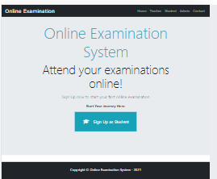

# Online-Examination-System

The Online Examination System is a web application built using Django that allows organizations and educational institutions to conduct online exams and assessments. This README provides an overview of the project and instructions for setting it up and using it.

## Display 


## Features

- User authentication and role management (Admin, Teacher, Student).
- Admin dashboard for creating and managing exams and questions.
- Teacher interface for creating and grading exams.
- Student portal for taking exams and viewing results.
- Timer and submission features for exams.
- User-friendly web interface.
- student login logout & teacher and staff
- Studnet Dashbord &Teacher Dashbord
## Usage
Admin (Admin Panel)

 Log in with the superuser account created in step 5.
 Create and manage exams, questions, and user accounts.
 
Teacher (Instructor Panel)

 Log in with a teacher account.
 Create exams, add questions, and set the exam details.
 Review and grade student submissions.
 
Student (Student Portal)

 Log in with a student account.
 Access available exams.
 Take exams, submit answers, and view results.
 
## Prerequisites

Before you begin, ensure you have met the following requirements:

- Python 3.x installed on your system.
- Django installed (you can install it using `pip install Django`).


# Setup  
```shell
   git clone https://github.com/Princeroy1/Online-Examination-System

   # Run the following commond:

   pip install -r requirements.txt
   python manage.py migrate

   # Create a Superuser by executing the following command:
   python manage.py createsuperuser


  #run project
  python manage.py runserver


## Contact 
https://github.com/Princeroy1/Django-Currency-Converter, Abdul Rouf, and abdulrouf8010@gmail.com 
